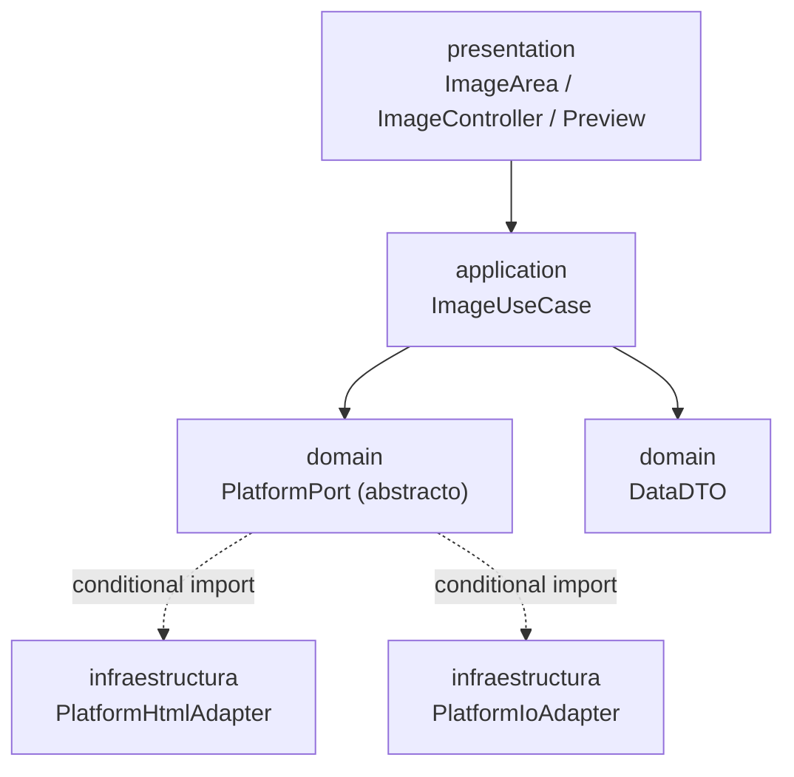

# Arquitectura hexagonal

El proyecto sigue **arquitectura hexagonal** (puertos y adaptadores). Se migró en dos pasos durante la versión 3.x (commits "hex architecture, first/second step") y se refactorizó por completo en 4.0.0.

## Capas

```
lib/
├── n_image_picker.dart                  # Barrel público (export)
└── src/
    ├── domain/
    │   ├── dtos/data_dto.dart           # DTO de imagen
    │   ├── enums/                       # AcceptedFormats, ResizeFormats
    │   └── ports/platform_port.dart     # Puerto abstracto de plataforma
    ├── application/
    │   └── use_cases/image_use_case.dart  # Casos de uso
    ├── infraestructure/
    │   ├── adapters/
    │   │   ├── platform_html_adapter.dart  # Adaptador web (DOM, drag & drop)
    │   │   └── platform_io_adapter.dart    # Adaptador IO (mobile/desktop)
    │   └── instances/platform_instance.dart # Selección condicional
    └── presentation/
        ├── image_zone.dart              # ImageController + ImageArea
        └── image_preview.dart           # Diálogo de vista previa
```

## Diagrama de dependencias



## Resolución del adaptador

El puerto `PlatformPort` es una clase abstracta con `factory PlatformPort() => getInstance()`. La función `getInstance()` se elige en tiempo de compilación mediante *conditional imports*:

```dart
import 'platform_instance.dart'
    if (dart.library.html) 'adapters/platform_html_adapter.dart'
    if (dart.library.io)   'adapters/platform_io_adapter.dart';
```

- Entorno **web** -> `platform_html_adapter.dart`
- Entorno **IO** (Android/iOS/Windows/macOS) -> `platform_io_adapter.dart`

## Reglas de la arquitectura
- El dominio no conoce Flutter widgets ni detalles de plataforma
- La presentación solo habla con `ImageUseCase` y `DataDTO`
- Toda operación dependiente de plataforma pasa por `PlatformPort`

## Relacionado
- [[PlatformPort y adaptadores]]
- [[Flujo de carga de imagen]]
- [[DataDTO]]
