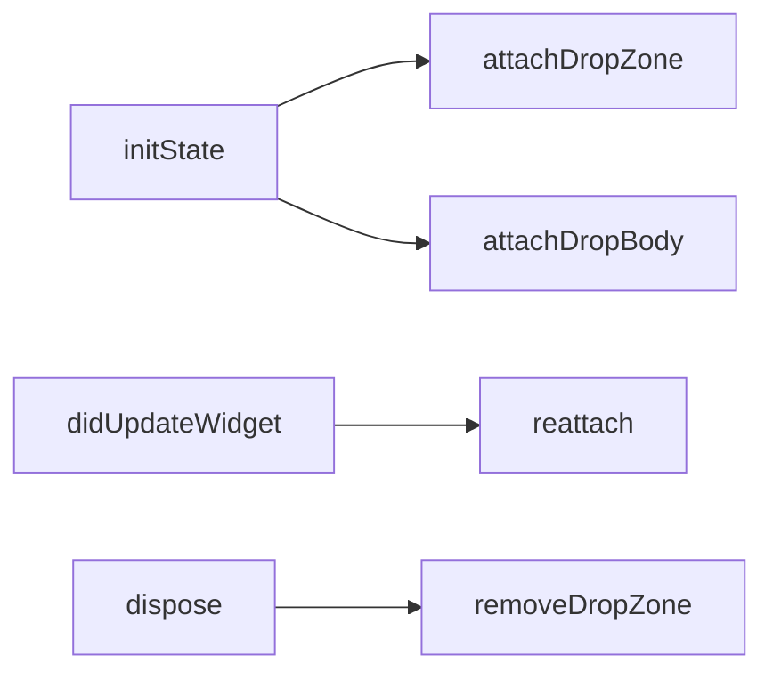

# Drag and Drop (Web)

Funcionalidad exclusiva de web, implementada en el adaptador HTML manipulando el DOM directamente (paquete `web`, antes `dart:html`).

## Comportamiento (desde v4.0.0)

- La zona de drop **no existe visualmente** hasta que algo se arrastra sobre la ventana
- Cuando un drag entra en pantalla, **todas** las `ImageArea` muestran su `onDragChild`
- Cada instancia registra elementos en el `<body>` identificados por el hashcode del contexto

## Registro y ciclo de vida

1. `ImageArea` pasa su `GlobalKey` a `ImageUseCase.attachDropZone/attachDropBody`
2. El use case extrae `RenderBox` + hashcode y delega en `PlatformPort`
3. El adaptador HTML muestra/oculta sus nodos con `show/hideDropZone(hashcode)`
4. Al soltar un archivo válido se entrega al controlador (mismo pipeline de [[Flujo de carga de imagen]])

## Señales expuestas

| Indicador | Uso |
|---|---|
| `controller.onDrag` | true mientras hay un drag activo |
| `onDragChild` | widget alternativo durante el drag |

## Historial relevante

| Versión | Cambio |
|---|---|
| 3.0.0 | Primera implementación de drop zone web |
| 3.2.0 | Detecta cambios de posición, evita drop zones duplicadas |
| 3.3.0 | Mostrar/ocultar elementos en el DOM |
| 4.0.0 | Zona solo aparece durante drag activo; indicador global `onDrag` |

## Relacionado
- [[PlatformPort y adaptadores]]
- [[ImageArea]]
