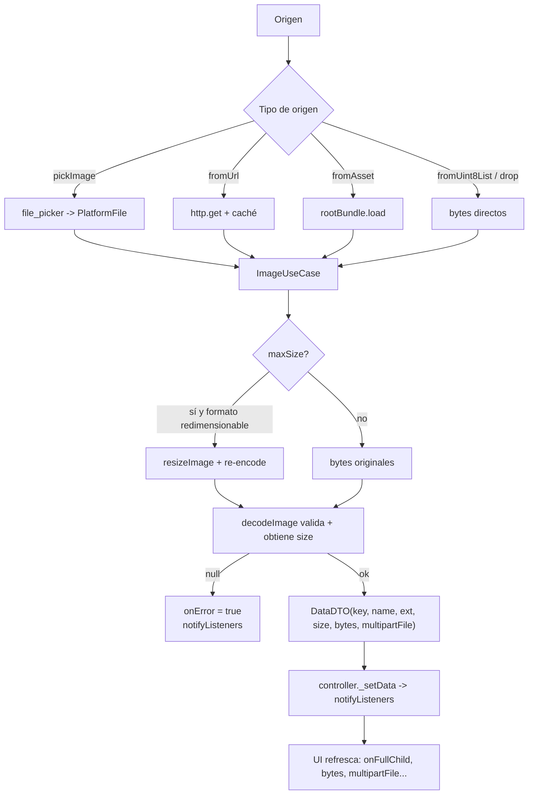

# Flujo de carga de imagen

Pipeline común para cualquier origen (picker, URL, asset, bytes, drag & drop).

## Diagrama general

## Detalles por paso

### 1. Obtención de bytes
- **Picker**: en web se usan `file.bytes`; en plataformas IO con `requirePath()` (macOS) se leen del disco con `getBytesFromPath`
- **URL**: primero `getCacheData(url)`; si no hay caché, `http.get` con headers y luego `putCacheData` (sin bloquear). La URL debe pasar la regex de [[Formatos de imagen]]
- **Asset**: `rootBundle.load` si el path no es una URL válida

### 2. Resize opcional
Ver reglas exactas en [[Formatos de imagen]]. Solo formatos `bmp, cur, jpg, png, pvr, tga, tiff`, solo si excede `maxSize`.

### 3. Validación y DTO
`img.decodeImage` actúa de validador real: si los bytes no decodifican, el caso de uso devuelve null y el controlador marca error.

### 4. Notificación
El controlador guarda el `DataDTO` y notifica; el listener del consumidor llama `setState`. Los getters (`bytes`, `multipartFile`, ...) ya devuelven los datos nuevos.

## Puntos de fallo comunes
- CORS en web ([[Configuración por plataforma]])
- Extensión no reconocida en URL -> intenta cargarla como asset y falla
- Cancelar el picker nativo (manejado desde v2.0.0)

## Relacionado
- [[ImageController]]
- [[DataDTO]]
- [[PlatformPort y adaptadores]]
